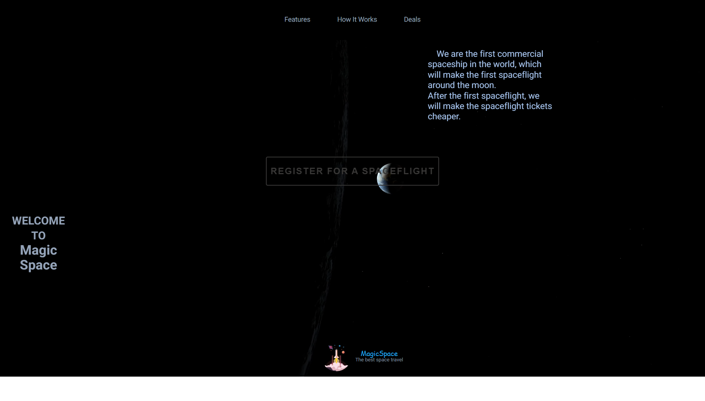
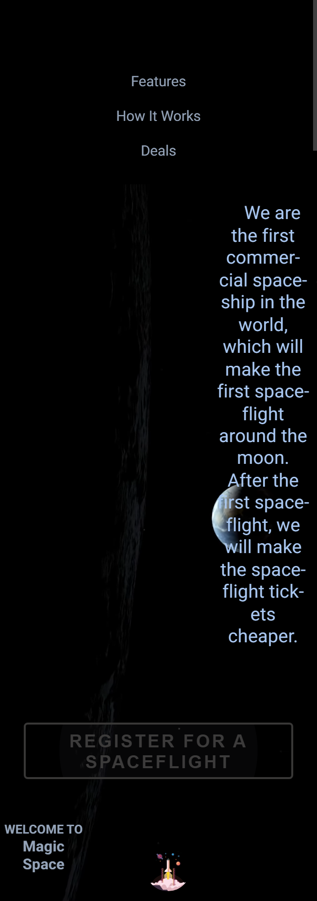

# Magic Space 🚀
A responsive landing page with cosmic-themed animations, built as part of The Odin Project and FreeCodeCamp curriculum.
Optimized for performance, accessibility, and SEO - achieving **100/100/100/100 Lighthouse scores** across mobile and desktop. 

<image-card alt="HTML5" src="https://img.shields.io/badge/HTML5-E34F26?style=flat-square&logo=html5" ></image-card>
<image-card alt="CSS3" src="https://img.shields.io/badge/CSS3-1572B6?style=flat-square&logo=css3" ></image-card>
<image-card alt="GitHub" src="https://img.shields.io/badge/GitHub-181717?style=flat-square&logo=github" ></image-card>
<image-card alt="Git" src="https://img.shields.io/badge/Git-F05032?style=flat-square&logo=git" ></image-card>
<image-card alt="VS Code" src="https://img.shields.io/badge/VS_Code-007ACC?style=flat-square&logo=visual-studio-code" ></image-card>

---

## ✨ Features
- Responsive video background with cosmic theme
- Rocket launch animations for headers
- Interactive buttons with hover effects
- Mobile-first design (320px → desktop)
- ✅ lighthouse: 100/100/100/100

---

## 🛠 Tech Stack
- HTML5
- CSS3
- Github Pages

---

## 🚀 Challenges and Solutions 
- **Video optimization**: Reduced assets from ~7.5B to ~2-3MB, improving Speed Index from 5.9s → 1.4s.
- **Responsive design**: Implemented media queries and flexbox for seamless layouts across devices. 
- **Accessibility**: Achieved 100% score by adding alt texts, semantic HTML, and aria-labels where needed.
- **SEO**: Added meta description and semantic structure to reach 100% SEO score.

---

## ⚡ Installation

```bash
git clone https://github.com/quiklydev/Magic-Space.git
cd Magic-Space
open index.html
```
# Or run with a local server:
npx live-server

## Demo
[Live Demo](https://quiklydev.github.io/Magic-Space/)

## Lighthouse Results

| Device / Width | Performance | Accessibility | Best Practices | SEO | Key Metrics |
|----------------|-------------|---------------|----------------|-----|-------------|
| Mobile 320px   | 100         | 100           | 100            | 100 | FCP 1.5s • LCP 1.5s • TBT 0ms • CLS 0.021 • SI 1.5s |
| Mobile 375px   | 100         | 100           | 100            | 100 | FCP 1.4s • LCP 1.4s • TBT 0ms • CLS 0.021 • SI 1.4s |
| Mobile 425px   | 100         | 100           | 100            | 100 | FCP 1.4s • LCP 1.4s • TBT 0ms • CLS 0.021 • SI 1.4s |
| Tablet 768px   | 100         | 100           | 100            | 100 | FCP 1.4s • LCP 1.4s • TBT 0ms • CLS 0.021 • SI 1.4s |
| Desktop        | 100         | 100           | 100            | 100 | FCP 0.4s • LCP 0.4s • TBT 0ms • CLS 0.001 • SI 0.4s |

✅ All metrics are in the green zone. Project is fully optimized.

## 📸 Screenshots
Desktop
- 


Mobile
-  

## 👨‍💻 About Me
I’m a front‑end developer passionate about creating responsive and accessible web experiences. Check out my other projects on GitHub.

## Feedback & Bugs
Found an issue? Create an issue here: https://github.com/quiklydev/Magic-Space/issues

Live demo: https://quiklydev.github.io/Magic-Space/
Maintained by: [@quiklydev](https://github.com/quiklydev)  
Contact: quiklydev.dev@gmail.com

## LICENSE

This project is licensed under the ISC LICENSE.
